# bk-vpc-network

## AWS Network Architecture

This repository contains the configuration for a resilient AWS network with the following architecture:
- **Virtual Private Cloud (VPC)** spanning two Availability Zones (AZs).
- **Subnets**: Each AZ has its own distinct Public and Private subnets.
- **Routing & Networking**: 
  - External traffic comes through **Amazon Route 53**.
  - **NAT Gateways** in each AZ's Public Subnet provide outbound internet access for the application servers in the Private Subnets.
- **Compute & Load Balancing**: 
  - An **Application Load Balancer (ALB)** is placed in the Public Subnets to distribute incoming external traffic.
  - An **Auto Scaling Group (ASG)** spans the Private Subnets, provisioning the application servers where the app is deployed.

### Network Diagram

```mermaid
architecture-beta
    group aws(cloud)[AWS Cloud]
    group vpc(cloud)[Virtual Private Cloud] in aws
    
    group az1(cloud)[Availability Zone 1] in vpc
    group public1(cloud)[Public Subnet] in az1
    group private1(cloud)[Private Subnet] in az1
    
    group az2(cloud)[Availability Zone 2] in vpc
    group public2(cloud)[Public Subnet] in az2
    group private2(cloud)[Private Subnet] in az2
    
    service user(internet)[External Traffic]
    service r53(aws-route53)[Amazon Route 53]
    
    service alb(aws-elastic-load-balancing)[Load Balancer] in vpc
    
    service alb1(aws-elastic-load-balancing)[ALB Node 1] in public1
    service nat1(aws-nat-gateway)[NAT Gateway 1] in public1
    service app1(aws-ec2)[App Server Instances] in private1
    
    service alb2(aws-elastic-load-balancing)[ALB Node 2] in public2
    service nat2(aws-nat-gateway)[NAT Gateway 2] in public2
    service app2(aws-ec2)[App Server Instances] in private2
    
    service asg(aws-auto-scaling)[Auto Scaling Group] in vpc
    
    user:B --> T:r53
    r53:B --> T:alb
    alb:B --> T:alb1
    alb:B --> T:alb2
    
    alb1:B --> T:app1
    alb2:B --> T:app2
    
    app1:R --> L:nat1
    app2:R --> L:nat2
    
    nat1:T --> B:user
    nat2:T --> B:user
```

