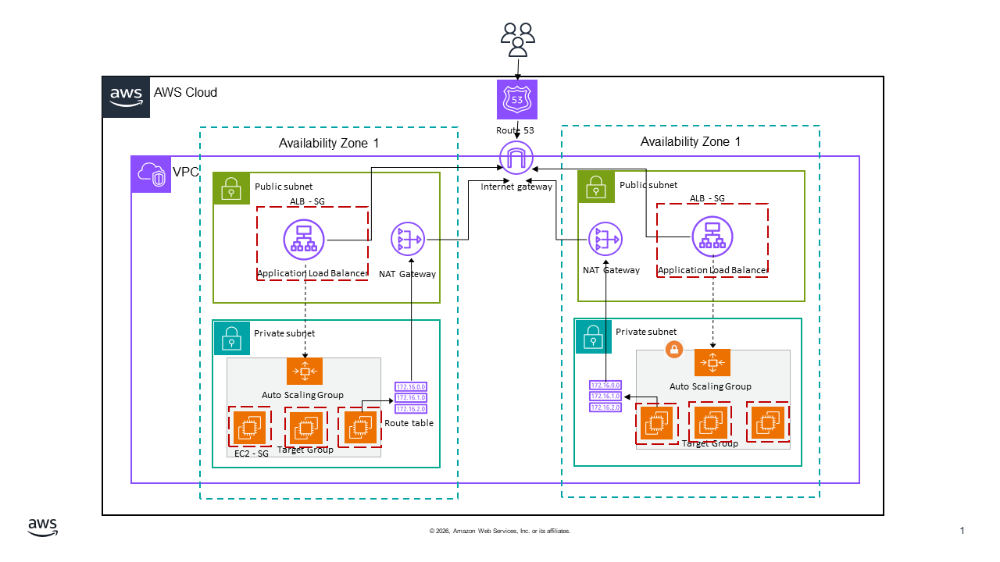

# bk-vpc-network

This repository contains the configuration for a resilient AWS network with the following architecture:
- **Virtual Private Cloud (VPC)** spanning two Availability Zones (AZs).
- **Subnets**: Each AZ has its own distinct Public and Private subnets.
- **Route Tables**:
  - **Private Route Table**: Associated with private subnets, routing outbound traffic to NAT Gateways.
- **Networking & Connectivity**: 
  - External traffic entry via **Amazon Route 53**.
  - **NAT Gateways** (one per AZ) reside in public subnets to provide secure outbound internet access for private resources.
- **Compute & Load Balancing**: 
  - An **Application Load Balancer (ALB)** in the public subnets handles external traffic distribution.
  - An **Auto Scaling Group (ASG)** in the private subnets manages the lifecycle of the application servers.
- **Security Groups**:
  - **ALB Security Group**: Allows inbound HTTP/HTTPS traffic from the internet and outbound traffic to the Application Security Group.
  - **Application Security Group**: Allows inbound traffic *only* from the ALB Security Group, ensuring the servers are not directly accessible from the internet.
